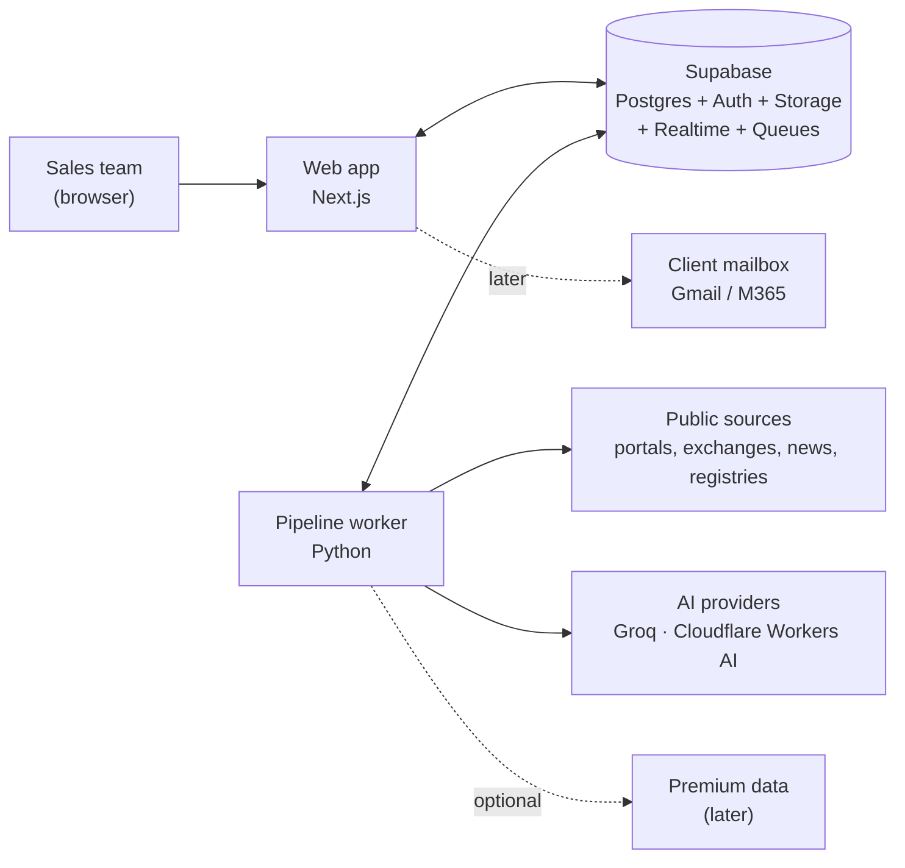
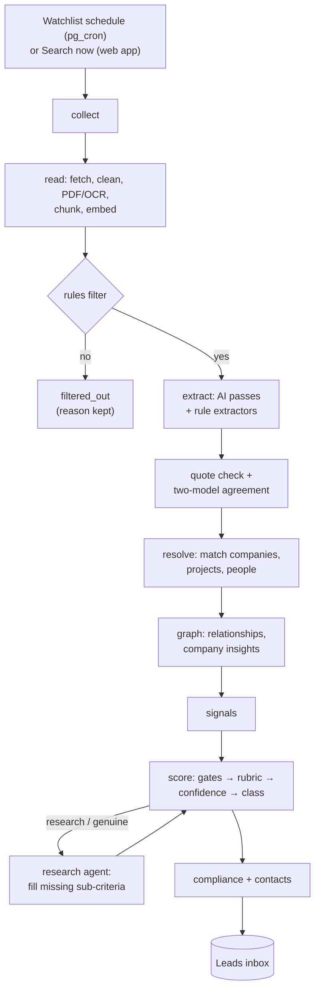
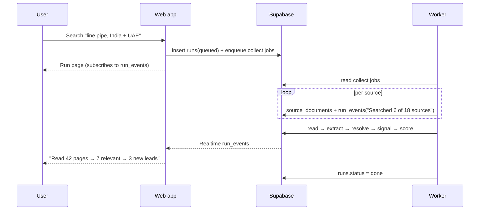
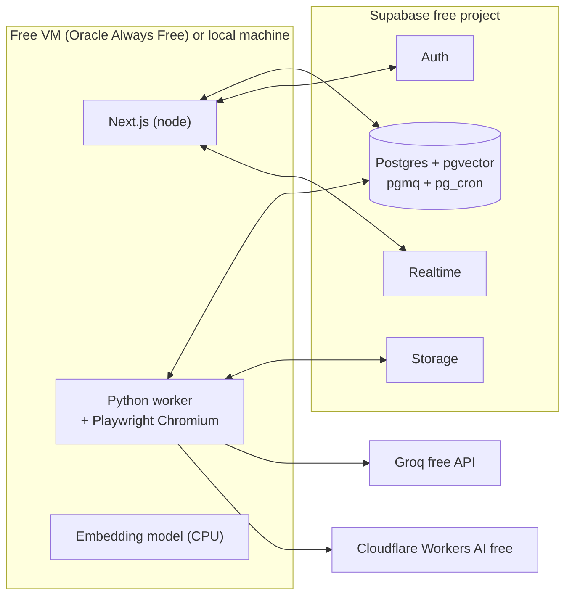

# 02 · Architecture

Owner of: system structure, components, data flow, runtime topology, security, reliability and observability. Tables are defined in [04](04-DATA-MODEL.md); tools in [03](03-TECH-STACK.md).

## 1. Principles

1. **Rules first, AI second.** Code does collection, parsing, matching, gating, scoring and compliance. AI only reads unstructured text and writes prose, and code checks its output.
2. **Evidence or it didn't happen.** A fact without a verified quote can't pass a gate.
3. **Everything is a background job.** Nothing slow runs inside a web request. The UI shows live progress from the database.
4. **Swappable providers.** Every outside service (AI, search, readers, contact data) sits behind an interface, so free services can be replaced by premium ones through configuration.
5. **Free by default.** The architecture fits within free tiers at MVP volume (see §8).

## 2. System context



- **Web app:** the four screens and a thin API. It never calls outside services directly.
- **Supabase:** the only shared state. It holds data, login, file storage, job queues, schedules and live updates.
- **Pipeline worker:** a long-running Python process. It takes jobs from the queues, calls sources and AI, and writes results.

## 3. Components

### 3.1 Web app (Next.js, TypeScript)

| Module | Responsibility |
|---|---|
| `app/(mvp)/find` | Start "Search now", manage watchlists, show live run progress |
| `app/(mvp)/leads` | Leads inbox: filter, sort, accept or reject |
| `app/(mvp)/leads/[id]` | Lead page: project, supply chain, team map, proof, score, research report, compliance, next step |
| `app/(mvp)/settings` | Client profile, products, markets, exclusions (admin only) |
| `app/api/runs` | Create a run: inserts `runs` and enqueues a `collect` job |
| `app/api/leads/[id]` | Update status, owner and next action; add activities |
| `app/api/drafts` | Request an email draft (enqueues a `draft` job) |
| `lib/supabase` | Server client (service role, server-only) and browser client (anon key) |
| `middleware / proxy.ts` | Enforces login on every page and API route |

The old prototype screens move to `app/(legacy)/…` behind an admin-only flag until MVP acceptance, then get deleted.

### 3.2 Pipeline worker (Python)

```
worker/
  main.py                 # queue consumers + scheduler bridge
  config.py               # env + feature flags
  queues.py               # pgmq read/ack/retry helpers
  sources/                # one reader per source type (05)
    base.py  gdelt.py  rss.py  ted.py  bse_nse.py  etimad.py
    myprocurement.py  newsroom.py  registry_*.py  sanctions.py
  read/                   # fetch, clean, PDF, OCR, chunk, embed
  filter/                 # rules-based relevance
  extract/                # AI passes + rule extractors (06)
    passes.py  schemas.py  prompts/  quote_check.py  agreement.py
  resolve/                # company, person and project matching
  graph/                  # relationships, company_insights
  signals/                # signal builder + fingerprints
  scoring/                # gates, rubric, confidence, classification (07)
  research/               # research tasks + report writer + judge (07 §7)
  contacts/               # contact tiers, email patterns, role mapping (08)
  compliance/             # bid + outreach rules engine, sanctions (08)
  llm/                    # provider clients, quota manager, usage log
  evals/                  # gold-set runner (11)
  tests/
```

### 3.3 Queues (pgmq)

| Queue | Message | Produces | Next queue |
|---|---|---|---|
| `collect` | `{run_id, source_id, query}` | `source_documents` (new) | `read` |
| `read` | `{document_id}` | text in Storage, `document_chunks`, rules filter result | `extract`, or stop with `filtered_out` |
| `extract` | `{document_id}` | `evidence`, raw extractions | `resolve` |
| `resolve` | `{document_id}` | companies, projects, packages, requirements, parties, people, relationships, `fact_evidence` | `signal` |
| `signal` | `{entity refs}` | `signals` | `score` |
| `score` | `{candidate lead key}` | `leads`, `lead_score_history` | `research` if class is research or genuine |
| `research` | `{lead_id}` | `research_tasks`, new evidence, `lead_research` | `score` (re-score), `compliance` |
| `compliance` | `{lead_id}` | `compliance_checks` | — |
| `contacts` | `{company_id, package_id}` | people, roles, `contact_points` | `score` |
| `draft` | `{lead_id, person_id}` | `outreach_drafts` | — |

Every message carries `run_id` when there is one, so progress shows up in `run_events`. Failed messages are retried 3 times with backoff (30 s, 2 min, 10 min), then parked in `<queue>_dead` for review.

## 4. End-to-end flow



### 4.1 "Search now" sequence



### 4.2 Predictive lead from the relationship graph

When a `contract_awarded` signal arrives for contractor X:
1. Look up `company_insights.typical_packages_subcontracted` for X.
2. For each package discipline the client covers, create a **supply / subcontract lead** on X's new project, even before any tender appears.
3. Score it. Timing is usually strong because the project has just been awarded; confidence depends on how solid the award evidence is.

## 5. Runtime topology (free)



- **Why both processes run on one VM:** Vercel's free Hobby plan forbids commercial use. The free VM keeps everything in one place.
- **Supabase free projects pause after 7 days without activity.** The daily watchlist job keeps the project active.
- **Scheduling:** `pg_cron` inserts due watchlists into `collect` every 15 minutes. The worker only consumes queues, so no scheduler runs on the VM.

## 6. Security

| Area | Control |
|---|---|
| Login | Supabase Auth (email magic link; Google or Microsoft optional). Every page and API route requires a session |
| Authorisation | Roles in `profiles.role`; row-level security on every table (04 §13) |
| Secrets | The service-role key and AI keys exist only on the server and worker, in environment files outside git. The prototype's shared key is **rotated before any build** |
| Browser | Uses the anon key only; RLS limits it to reads and the allowed writes |
| Outbound | The worker obeys robots.txt and each site's terms, sends a clear user agent, and rate-limits per domain (05 §6). No login-bypass and no LinkedIn scraping |
| Personal data | Business contacts only, each with an origin label. Opt-out list checked before any draft. Retention: contacts unused for 24 months are purged (08) |
| Audit | `activities` for user actions; `run_events` and `llm_usage` for system actions |

## 7. Reliability and observability

- **Idempotency:**
  - Documents are unique by `canonical_url` and `content_hash`.
  - Signals are unique by `fingerprint`.
  - Leads are unique by `(buyer, project, package, kind)`.
  - Re-running a job never creates duplicates.
- **Retries:** queue retries with backoff; the AI client switches provider when a quota is hit (06 §7).
- **Degraded mode:** if both AI providers are out of quota, documents wait in `extract` and the UI shows "AI queue paused until quota resets". Rules-only signals (such as structured TED awards) keep flowing.
- **Logs:** structured JSON logs from the worker, with the run_id on every line.
- **Errors:** Sentry free tier for the web app and worker.
- **Health page:** queue depth per queue, last successful run per source, AI tokens used today per provider, dead-letter count.

## 8. Capacity at MVP volume (free tiers)

| Resource | Free limit | MVP use (estimate) |
|---|---|---|
| Groq | 1,000 requests and 200K tokens a day | About 60–100 documents a day at 2K tokens each |
| Cloudflare Workers AI | 10,000 Neurons a day (roughly 0.3–0.5M tokens on gpt-oss-20b) | Second-model checks and overflow |
| Supabase database | 500 MB | Text goes to Storage, not the database; embeddings only for chunks of relevant documents |
| Supabase Storage | 1 GB | Keep 90 days of documents; older raw text is pruned, while evidence quotes stay forever |
| VM | Up to 4 ARM cores, 24 GB RAM (Oracle Always Free, region-dependent) | Next.js, the worker, headless Chromium and the embedding model |

Rules remove most pages before AI (target: 80% or more filtered out), so about 150–300 documents a day can be collected, while 60–150 of them reach AI. If volume grows past this, the provider switch in §1.4 moves extraction to a paid model without code changes.

## 9. Extension points

| Interface | Free implementation | Premium plug-in (later) |
|---|---|---|
| `LLMProvider` | Groq, Cloudflare | Claude Haiku / Sonnet |
| `SearchProvider` | GDELT, RSS, official APIs | Brave, SerpAPI |
| `PageReader` | Crawl4AI / Playwright | Firecrawl, Zyte |
| `ContactProvider` | Official public + derived | Apollo, Lusha, Cognism, ZoomInfo |
| `EmailVerifier` | MX check | ZeroBounce, NeverBounce |
| `TradeDataProvider` | none | Volza |
| `ProjectDataProvider` | none | Project databases (e.g. GlobalData, IJGlobal) |

Each is chosen per environment through the `PROVIDERS__*` settings (03 §6).
