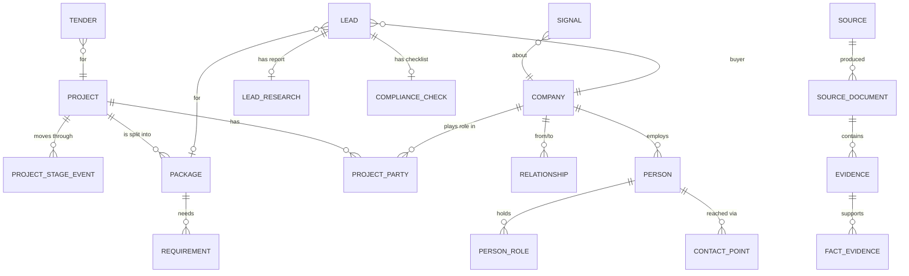

# 04 · Data model

Owner of: every table, enum, relationship, provenance rule and index. Other documents use these names exactly.

Database: **Supabase Postgres** (free tier) with the `pgvector`, `pgmq` and `pg_cron` extensions. All ids are `uuid` unless stated. All tables have `created_at timestamptz default now()` and, where rows change, `updated_at timestamptz`.

## 1. Design principles

1. **Everything is linked.** Project → packages → requirements; companies ↔ projects through roles; people ↔ projects and packages through buying roles. Nothing important lives only in free text.
2. **Every fact has provenance.** Any field that came from outside is linked to an `evidence` row (URL + exact quote), through `fact_evidence`.
3. **Unknown is a value.** Fields are nullable. Null means "not found", never "false".
4. **History is kept.** Stage changes, scores and statuses are stored as events, not overwritten.
5. **Rules are data.** Scoring weights, compliance rules and source settings live in tables, so they can be tuned without code changes.

## 2. Entity overview



## 3. Enums

```sql
create type market_code as enum ('IN','SA','AE','QA','OM','KW','BH','NO','MY');  -- extend per assumption A1/A2

create type project_stage as enum (
  'concept','feasibility','feed','prequalification','epc_tender','awarded',
  'detailed_engineering','procurement','construction','commissioning',
  'operations','on_hold','cancelled','completed');

create type discipline as enum (
  'civil_structural','static_equipment','rotating_equipment','piping','pipeline',
  'electrical','instrumentation_control','telecom','hvac','fire_safety',
  'insulation_painting','logistics_heavy_lift','procurement_services',
  'construction_services','commissioning_services','engineering_services','other');

create type company_type as enum (
  'owner','pmc_consultant','main_epc','subcontractor','fabricator',
  'manufacturer','stockist_trader','logistics','financier','government_buyer','other');

create type party_role as enum (
  'owner','pmc','consultant','main_epc','consortium_member','subcontractor',
  'supplier','logistics','financier');

create type relationship_type as enum (
  'awarded_to',          -- owner -> contractor
  'subcontracted_to',    -- contractor -> subcontractor
  'supplied_by',         -- buyer -> supplier
  'partnered_with',      -- joint venture / consortium
  'approved_vendor_of'); -- supplier listed as approved make/vendor by buyer

create type buying_role as enum (
  'decision_maker','project_director','procurement_lead','package_manager',
  'technical_evaluator','discipline_lead','expediting','logistics_coordinator',
  'tender_contact','executive','other');

create type signal_type as enum (
  'capex_plan','project_announced','feed_awarded','permit_approved',
  'prequalification_opened','tender_released','tender_closing_soon',
  'bid_results_published','contract_awarded','subcontract_awarded',
  'supply_order_announced','vendor_registration_opened','approved_vendor_listed',
  'hiring_project_roles','import_shipment','engagement');

create type lead_kind as enum ('bid','supply_subcontract');
create type lead_class as enum ('genuine','research','watch','rejected');
create type lead_status as enum ('new','accepted','rejected','contacted','rfq','quoted','won','lost');
create type confidence_band as enum ('high','medium','low');
create type source_tier as enum ('A','B','C');
create type access_method as enum ('api','rss','html','pdf','manual');
create type doc_status as enum ('new','filtered_out','queued','extracted','failed');
create type contact_kind as enum ('email','phone','website','address','profile_url');
create type contact_origin as enum ('official_public','derived','licensed','client_supplied');
create type contact_status as enum ('unverified','mx_ok','verified','bounced','opted_out');
create type check_status as enum ('met','missing','unknown','not_applicable');
```

## 4. Client configuration

The client's own profile drives scope fit, eligibility and logistics scoring.

```sql
create table client_profile (          -- single row for the MVP
  id uuid primary key default gen_random_uuid(),
  company_name text not null,
  markets market_code[] not null,
  disciplines discipline[] not null,            -- what the client can deliver
  adjacent_disciplines discipline[] default '{}', -- partial credit in scoring
  min_project_value_usd numeric,                -- below = gate fail
  sweet_spot_min_usd numeric, sweet_spot_max_usd numeric,
  served_ports text[] default '{}',             -- logistics fit
  served_regions text[] default '{}',
  certifications text[] default '{}',           -- e.g. ISO 9001, API Q1, API 5L
  local_content jsonb default '{}',             -- {"SA":{"iktva_score":...},"AE":{"icv_cert_valid_until":"..."},"IN":{"ppp_mii_class":"I"}}
  registrations jsonb default '{}',             -- {"etimad":true,"adnoc_supplier_hub":false,...}
  excluded_company_ids uuid[] default '{}',     -- competitors, do-not-contact
  updated_at timestamptz);

create table client_products (
  id uuid primary key default gen_random_uuid(),
  name text not null,                 -- "Carbon steel line pipe"
  discipline discipline not null,
  hs_codes text[] default '{}',       -- e.g. {'7305','7306'}
  keywords text[] default '{}',       -- synonyms used by rules
  spec_ranges jsonb default '{}',     -- {"standard":["API 5L"],"grade":["X52","X65"],"od_in":[4,48]}
  active boolean default true);
```

## 5. Sources and documents

```sql
create table sources (
  id uuid primary key default gen_random_uuid(),
  market market_code,                 -- null = global (e.g. GDELT)
  category text not null,             -- tender_portal | exchange | newsroom | trade_press | registry | news_index | company_site | dataset
  name text not null,
  base_url text not null,
  access access_method not null,
  tier source_tier not null,
  schedule_cron text not null,        -- e.g. '0 */6 * * *'
  requires_login boolean default false,
  robots_allowed boolean,             -- checked at setup and monthly
  terms_notes text,
  reader_key text not null,           -- which reader class handles it
  enabled boolean default true,
  reliability numeric default 0.5,    -- learned: share of its docs that became qualified leads
  last_run_at timestamptz);

create table source_documents (
  id uuid primary key default gen_random_uuid(),
  source_id uuid references sources,
  url text not null,
  canonical_url text not null unique,
  title text,
  language text,                      -- ISO 639-1
  published_at timestamptz,
  fetched_at timestamptz not null default now(),
  content_hash text not null,         -- sha256 of normalised text; change detection
  storage_path text,                  -- full text / PDF in Supabase Storage
  status doc_status not null default 'new',
  filter_reason text,
  run_id uuid);
create index on source_documents (status, fetched_at desc);
create index on source_documents (content_hash);

create table document_chunks (
  id uuid primary key default gen_random_uuid(),
  document_id uuid references source_documents on delete cascade,
  idx int not null,
  text text not null,
  char_start int not null, char_end int not null,
  tokens int,
  embedding vector(384));             -- multilingual-e5-small
```

## 6. Evidence and provenance

```sql
create table evidence (
  id uuid primary key default gen_random_uuid(),
  document_id uuid references source_documents,
  url text not null,
  quote text not null,                -- verbatim
  char_start int, char_end int,       -- position in the document text
  extracted_by text not null,         -- 'rule:<name>' or 'model:<provider>/<model>'
  quote_verified boolean not null,    -- see 06 §5
  agreement text,                     -- 'both' | 'single' | 'rule'
  tier source_tier not null,
  publisher_key text not null,        -- normalised domain group; used for independence
  observed_at timestamptz not null default now());

create table fact_evidence (           -- links any field of any entity to evidence
  entity_type text not null,          -- 'company' | 'project' | 'package' | 'requirement' | 'tender' | 'person' | 'person_role' | 'project_party' | 'relationship' | 'contact_point'
  entity_id uuid not null,
  field text not null,                -- e.g. 'estimated_value', 'role', '*' for the whole row
  evidence_id uuid references evidence on delete cascade,
  primary key (entity_type, entity_id, field, evidence_id));
```

## 7. Companies, projects, packages

```sql
create table companies (
  id uuid primary key default gen_random_uuid(),
  canonical_name text not null,
  normalized_name text not null,      -- lowercase, legal suffixes removed
  country text,
  types company_type[] default '{}',
  registry_source text, registry_id text,   -- e.g. 'IN-MCA', CIN
  lei text,
  domain text,
  parent_company_id uuid references companies,
  listed_exchange text, ticker text,
  status text,                        -- active | struck_off | unknown (from registry)
  size_band text,
  embedding vector(384),
  match_certainty numeric default 0.6,-- see 07 §4
  verified_at timestamptz);
create unique index on companies (registry_source, registry_id) where registry_id is not null;
create index on companies using gin (to_tsvector('simple', canonical_name));

create table company_aliases (
  company_id uuid references companies on delete cascade,
  alias text not null, language text, source text,
  primary key (company_id, alias));

create table projects (
  id uuid primary key default gen_random_uuid(),
  name text not null,
  normalized_name text not null,
  owner_company_id uuid references companies,
  country text, site text, region text,
  sector text,                         -- oil_gas | water | power | petrochemical | infrastructure | mining | other
  project_type text,                   -- pipeline | refinery | desalination | ...
  current_stage project_stage,
  estimated_value numeric, currency text, value_usd numeric,
  funding_status text,                 -- announced | budgeted | fid | awarded | unknown
  start_date date, end_date date,
  specs jsonb default '{}',            -- {"length_km":120,"diameter_in":24,"grade":"X65"}
  status text default 'active',        -- active | cancelled | completed
  embedding vector(384));

create table project_stage_events (
  id uuid primary key default gen_random_uuid(),
  project_id uuid references projects on delete cascade,
  stage project_stage not null,
  event_date date,
  evidence_id uuid references evidence);

create table packages (
  id uuid primary key default gen_random_uuid(),
  project_id uuid references projects on delete cascade,
  discipline discipline not null,
  name text not null,                  -- "Line pipe supply", "Mechanical & piping works"
  scope_text text,
  package_owner_company_id uuid references companies,  -- who buys this package
  procurement_route text,              -- open_tender | prequal | approved_vendor_list | direct | unknown
  status text,                         -- planned | tendering | awarded | in_progress | closed
  estimated_value numeric, currency text, value_usd numeric,
  needed_by date);

create table requirements (
  id uuid primary key default gen_random_uuid(),
  package_id uuid references packages on delete cascade,
  item_category text not null,         -- "line pipe", "gate valves"
  client_product_id uuid references client_products,  -- set by matcher
  spec jsonb default '{}',             -- {"standard":"API 5L","grade":"X65","od_in":24,"wt_mm":12.7,"coating":"3LPE"}
  quantity numeric, unit text,         -- t | km | m | pcs | lot
  needed_by date,
  delivery_site text, delivery_port text, incoterm text, transport_mode text,
  hs_code text);

create table project_parties (
  id uuid primary key default gen_random_uuid(),
  project_id uuid references projects on delete cascade,
  company_id uuid references companies,
  role party_role not null,
  package_id uuid references packages,
  scope_text text,
  contract_value numeric, currency text, value_usd numeric,
  award_date date,
  status text);                        -- announced | awarded | active | completed | terminated

create table tenders (
  id uuid primary key default gen_random_uuid(),
  source_id uuid references sources,
  portal_ref text,                     -- portal's tender number
  title text not null,
  buyer_company_id uuid references companies,
  project_id uuid references projects, package_id uuid references packages,
  issue_date date, closing_date date,
  status text,                         -- open | closed | awarded | cancelled
  estimated_value numeric, currency text,
  document_access text,                -- public | login | paid
  boq_available boolean,
  contact_person_id uuid,              -- references people (tender contact officer)
  url text not null,
  unique (source_id, portal_ref));
```

## 8. People, roles and contacts

```sql
create table people (
  id uuid primary key default gen_random_uuid(),
  full_name text not null,
  normalized_name text not null,
  current_company_id uuid references companies,
  title text, department text, seniority text,   -- executive | director | manager | specialist
  country text,
  profile_url text);                   -- link only; profiles are never scraped

create table person_roles (            -- the team map
  id uuid primary key default gen_random_uuid(),
  person_id uuid references people on delete cascade,
  company_id uuid references companies,
  project_id uuid references projects,
  package_id uuid references packages,
  buying_role buying_role not null,
  works_with_person_id uuid references people,   -- coordination link
  start_date date, end_date date);

create table contact_points (
  id uuid primary key default gen_random_uuid(),
  person_id uuid references people on delete cascade,
  company_id uuid references companies on delete cascade,
  kind contact_kind not null,
  value text not null,
  origin contact_origin not null,
  status contact_status not null default 'unverified',
  last_checked_at timestamptz,
  check check (person_id is not null or company_id is not null));

create table opt_outs (
  id uuid primary key default gen_random_uuid(),
  kind contact_kind not null,          -- email | phone
  value text not null,                 -- full address, number or '@domain'
  reason text, recorded_at timestamptz default now(),
  unique (kind, value));
```

## 9. Relationship graph and history

```sql
create table relationships (
  id uuid primary key default gen_random_uuid(),
  from_company_id uuid references companies not null,
  to_company_id uuid references companies not null,
  type relationship_type not null,
  project_id uuid references projects,
  package_id uuid references packages,
  discipline discipline,
  event_date date,
  value_usd numeric);

create table trade_records (           -- only if the client provides Volza exports (assumption A5)
  id uuid primary key default gen_random_uuid(),
  company_id uuid references companies,
  direction text,                      -- import | export
  hs_code text, product_text text,
  quantity numeric, unit text, value_usd numeric,
  partner_company_id uuid references companies,
  origin_country text, port text, shipment_date date);

create materialized view company_metrics as
  select c.id as company_id,
    count(distinct pp.project_id) filter (where pp.award_date > now() - interval '5 years') as awards_5y,
    sum(pp.value_usd) filter (where pp.award_date > now() - interval '5 years') as award_value_5y_usd,
    max(pp.award_date) as last_award_date
  from companies c left join project_parties pp on pp.company_id = c.id
  group by c.id;
-- Regular suppliers and subcontracting patterns are computed by the worker into company_insights (below),
-- because they need the "2 independent evidences within 36 months" rule from 07 §6.

create table company_insights (
  company_id uuid primary key references companies,
  sectors text[], countries text[],
  typical_packages_subcontracted discipline[],
  typical_packages_self_performed discipline[],
  regular_suppliers jsonb default '[]',   -- [{"company_id":...,"discipline":...,"evidence_count":3,"last_date":"..."}]
  regular_partners jsonb default '[]',
  computed_at timestamptz);
```

## 10. Signals, leads, research, compliance

```sql
create table signals (
  id uuid primary key default gen_random_uuid(),
  type signal_type not null,
  signal_date date not null,
  company_id uuid references companies,
  project_id uuid references projects,
  package_id uuid references packages,
  tender_id uuid references tenders,
  summary text not null,
  fingerprint text not null unique,    -- same event from many sources = one signal (07 §2)
  evidence_ids uuid[] not null);

create table leads (
  id uuid primary key default gen_random_uuid(),
  kind lead_kind not null,
  buyer_company_id uuid references companies not null,
  project_id uuid references projects,
  package_id uuid references packages,
  tender_id uuid references tenders,
  client_product_ids uuid[] default '{}',
  score int check (score between 0 and 100),
  score_breakdown jsonb not null,      -- {"scope_fit":{"total":21,"sub":{"1.1":10,...},"unknown":["1.2"]},...}
  gate_results jsonb not null,         -- {"G1":{"pass":true,"why":"MCA CIN match"},...}
  confidence numeric check (confidence between 0 and 1),
  confidence_band confidence_band,
  class lead_class not null,
  reasons jsonb not null,              -- top 3 plain-language reasons, each with evidence ids
  status lead_status not null default 'new',
  owner_user_id uuid,
  next_action text,
  scoring_version int not null,
  unique (buyer_company_id, project_id, package_id, kind));

create table lead_score_history (
  lead_id uuid references leads on delete cascade,
  scored_at timestamptz default now(),
  score int, confidence numeric, class lead_class, scoring_version int);

create table lead_research (
  lead_id uuid primary key references leads on delete cascade,
  sections jsonb not null,             -- [{"title":"Company background","sentences":[{"text":"...","evidence_ids":[...],"check":"supported"}]}]
  generated_at timestamptz, model text, version int);

create table research_tasks (
  id uuid primary key default gen_random_uuid(),
  lead_id uuid references leads on delete cascade,
  sub_criterion text not null,         -- e.g. '4.2' (verified decision maker)
  query_plan jsonb, status text default 'queued',  -- queued | running | done | failed
  findings jsonb, finished_at timestamptz);

create table compliance_rules (
  id uuid primary key default gen_random_uuid(),
  market market_code not null,
  kind text not null,                  -- 'bid' | 'outreach'
  rule_key text not null,              -- 'SA_IKTVA', 'IN_TRAI_140', ...
  title text not null, description text not null,
  applies_when jsonb default '{}',     -- e.g. {"buyer":"aramco"} or {"channel":"phone"}
  hard boolean default false,          -- hard = blocks eligibility if missing
  source_url text not null,
  effective_from date,
  unique (market, kind, rule_key));

create table compliance_checks (
  lead_id uuid primary key references leads on delete cascade,
  bid_items jsonb not null,            -- [{"rule_key":"SA_IKTVA","status":"unknown","note":"..."}]
  outreach_items jsonb not null,       -- per contact: [{"person_id":...,"email":"allowed|opt_out_only|consent_needed","phone":"...","steps":[...]}]
  evaluated_at timestamptz);

create table sanctions_entries (
  id uuid primary key default gen_random_uuid(),
  list_source text not null,          -- OFAC_SDN | UN | EU | UK | UAE_LOCAL
  name text not null, aliases text[], entity_type text, country text,
  list_updated_at date);
create table sanctions_matches (
  id uuid primary key default gen_random_uuid(),
  entry_id uuid references sanctions_entries,
  company_id uuid references companies, person_id uuid references people,
  match_score numeric, status text default 'to_review');  -- to_review | confirmed | cleared
```

## 11. Workflow, runs and usage

```sql
create table watchlists (
  id uuid primary key default gen_random_uuid(),
  name text not null,
  markets market_code[] not null,
  disciplines discipline[] default '{}',
  client_product_ids uuid[] default '{}',
  keywords text[] default '{}',
  lead_kinds lead_kind[] default '{bid,supply_subcontract}',
  schedule_cron text not null default '0 6 * * *',
  active boolean default true,
  owner_user_id uuid);

create table runs (
  id uuid primary key default gen_random_uuid(),
  watchlist_id uuid references watchlists,
  adhoc_query jsonb,                   -- for "Search now"
  status text not null default 'queued',  -- queued | running | done | failed | cancelled
  started_at timestamptz, finished_at timestamptz,
  counters jsonb default '{}',         -- {"sources":18,"pages":42,"relevant":7,"new_leads":3}
  error text);

create table run_events (              -- drives the live progress bar (Supabase Realtime)
  id bigserial primary key,
  run_id uuid references runs on delete cascade,
  ts timestamptz default now(),
  stage text not null,                 -- collect | filter | read | extract | match | score | research
  message text not null,
  counters jsonb);

create table activities (
  id uuid primary key default gen_random_uuid(),
  lead_id uuid references leads on delete cascade,
  person_id uuid references people,
  type text not null,                  -- note | status_change | email_draft | email_sent | call | meeting
  body text, user_id uuid);

create table outreach_drafts (
  id uuid primary key default gen_random_uuid(),
  lead_id uuid references leads on delete cascade,
  person_id uuid references people,
  subject text, body text, language text,
  status text default 'draft',         -- draft | approved | sent_externally
  model text, created_by uuid);

create table llm_usage (
  id bigserial primary key,
  ts timestamptz default now(),
  provider text, model text, purpose text,   -- triage | extract_entities | extract_packages | extract_people | research | report | draft | judge
  tokens_in int, tokens_out int, run_id uuid, ok boolean);

create table scoring_config (
  version int primary key,
  weights jsonb not null,              -- full rubric from 07 §3
  thresholds jsonb not null,           -- {"genuine_min":70,"research_min":55,"high_conf":0.8,"medium_conf":0.5}
  active boolean default false,
  notes text);
```

## 12. Evaluation tables

See 11 for how they're used.

```sql
create table gold_documents (id uuid primary key, document_id uuid references source_documents, market market_code, split text); -- train | test
create table gold_labels (id uuid primary key default gen_random_uuid(), gold_document_id uuid references gold_documents, label_type text, payload jsonb, labeller text);
create table eval_runs (id uuid primary key default gen_random_uuid(), ran_at timestamptz default now(), pipeline_version text, metrics jsonb);
```

## 13. Security (row-level)

- Row-level security is **on for every table**.
- Signed-in users can **read** all business tables.
- **Writes from the browser** are allowed only on `leads.status`, `leads.owner_user_id`, `leads.next_action`, `activities`, `outreach_drafts`, `watchlists`, `client_profile` and `client_products`. Everything else is written by the worker using the service role, which never reaches the browser.
- Roles are held in `profiles.role` (existing enum: ADMIN, ANALYST, SALES, VIEWER). Only ADMIN edits `client_profile`, `sources`, `compliance_rules` and `scoring_config`.

## 14. Migration from the prototype

| Prototype table | Action |
|---|---|
| `profiles`, `app_role` | Keep |
| `companies`, `company_aliases`, `sources`, `projects`, `tenders`, `signals`, `buyer_scores` (migration 0001) | Replace with the definitions above. They were never populated |
| `discovery_candidates`, `converted_discovery_leads`, `discovery_decision_makers`, lead-list tables, job tables, `discovery_crm_activities` | Freeze read-only; export for reference; drop after MVP acceptance |
| `saved_discovery_searches` | Convert rows into `watchlists` |

New migrations start at `0100_mvp_*.sql`, so they're clearly separate from the prototype's `0001–0013`.
