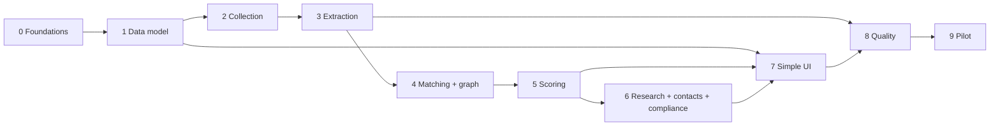

# 10 · Build plan

Owner of: phases, tasks, deliverables, acceptance tests, dependencies and working rules. **No calendar dates:** the timeline is agreed with the client. Each task has a relative size (S = up to 1 day, M = 2–4 days, L = about a week for one engineer) to help sequencing, not for billing.

## 1. Phase overview

| Phase | Name | Outcome | Depends on |
|---|---|---|---|
| **0** | Kickoff and foundations | Secure repo, accounts, CI, worker skeleton, login | Decisions A1–A7, keys |
| **1** | Data model and client profile | New schema live; client profile, products, compliance rules and sanctions loaded | 0 |
| **2** | Collection | Readers for all 4 market groups; documents flowing on schedules | 1 |
| **3** | Reading and AI extraction | Clean text, rules filter, P0–P3 passes, quote check, two-model agreement; test set v1 | 2 |
| **4** | Matching and relationship graph | Companies, projects and people merged; relationships; contractor history | 3 |
| **5** | Signals, scoring and classification | Gates, 17 sub-criteria, confidence, classes, reasons, predictive leads | 4 |
| **6** | Research, contacts and compliance | Research agent, reports with fact checks, contact tiers, compliance checklists | 5 |
| **7** | Simple UI | Find, Leads, Lead page, Settings, Health; legacy screens hidden | 1 (start); 5–6 (data) |
| **8** | Quality and tuning | Full test set, release gates, tuning to targets | 3–7 |
| **9** | Pilot and handover | Real demo on the client's products and markets; runbook | 8 |

**Critical path:** 0 → 1 → 2 → 3 → 4 → 5 → 6 → 8 → 9.

**Parallel tracks:**
- The UI (7) starts right after phase 1, using seeded data.
- Test-set labelling (8) starts as soon as phase 2 produces documents.

## 2. Phases in detail

### Phase 0 · Kickoff and foundations

**Goal:** a safe, working base.

| ID | Task | Size |
|---|---|---|
| 0.1 | Confirm assumptions A1–A7 with the client; collect disciplines, products, certifications, registrations and exclusions | S |
| 0.2 | Create accounts: Supabase (dev + demo projects), Groq, Cloudflare, Oracle Cloud VM, GitHub private repo, Sentry; Etimad developer sandbox | S |
| 0.3 | Put the codebase in git; pin all package versions (no `latest`); add `.env.example` files from 03 §6 | S |
| 0.4 | **Rotate the prototype's Supabase service key.** Remove secrets from any file | S |
| 0.5 | Supabase Auth login (magic link); `proxy.ts` enforces a session on every page **and** every API route; roles from `profiles` | M |
| 0.6 | Move prototype screens into `app/(legacy)` behind the admin role; add the empty `app/(mvp)` layout with the 4-item sidebar | S |
| 0.7 | Python worker skeleton: config, structured logs, pgmq consumer loop, health endpoint, systemd units; runs on the VM | M |
| 0.8 | CI: lint, typecheck, Vitest, pytest, migration dry-run on every PR | S |
| 0.9 | Enable `pgvector`, `pgmq` and `pg_cron` in Supabase; create the queues from 02 §3.3 | S |

**Exit criteria:**
- No page or API is reachable without login (automated test).
- The worker consumes a test message end to end.
- CI is green.
- The old key is revoked.

### Phase 1 · Data model and client profile

| ID | Task | Size |
|---|---|---|
| 1.1 | Migrations `0100_mvp_enums` … `0110_mvp_eval` implementing 04 §3–12 | L |
| 1.2 | RLS policies and tests (04 §13) | M |
| 1.3 | Generate TypeScript database types; Pydantic models for the worker | S |
| 1.4 | Seed `compliance_rules` (08 §2.1 and §3) and `scoring_config` v1 (07) | M |
| 1.5 | Sanctions loaders (OFAC, UN, EU, UK, UAE) plus the daily cron | M |
| 1.6 | Settings API and UI shell for client profile and products (full UI in phase 7) | M |
| 1.7 | Export prototype `discovery_*` data; convert saved searches to watchlists | S |

**Exit criteria:**
- The schema is applied on both projects.
- RLS tests pass.
- The client profile and at least 5 products are entered.
- The sanctions lists are loaded, with row counts logged.

### Phase 2 · Collection

| ID | Task | Size |
|---|---|---|
| 2.1 | Reader framework (05 §3), politeness layer (rate limits, robots, user agent), `runs` and `run_events` writing | M |
| 2.2 | Global readers: GDELT, generic RSS, company-site crawler (Crawl4AI) | M |
| 2.3 | India: BSE and NSE RSS + filing PDFs; CPPP list pages; GeM bid PDFs; ETEnergyWorld / ETInfra RSS | L |
| 2.4 | Saudi Arabia: Etimad API (sandbox → production) + public list; Tadawul announcements; owner newsrooms | L |
| 2.5 | UAE: ADGPG, eSupply lists; ADX/DFM disclosures; ADNOC and DEWA newsrooms | M |
| 2.6 | Norway: TED search API (structured award fields → rule evidence); Oslo Børs NewsWeb; brreg lookups | M |
| 2.7 | Malaysia: MyProcurement adverts and results; Bursa announcements | M |
| 2.8 | Qatar, Oman, Kuwait, Bahrain portals (lists only) | M |
| 2.9 | Watchlist scheduling through `pg_cron`; Search now API (`POST /api/runs`) | S |

**Exit criteria:**
- Every enabled source completes a scheduled run.
- Documents are de-duplicated (re-running creates no duplicates).
- Robots and terms notes are recorded for every source.
- `run_events` show progress.

### Phase 3 · Reading and AI extraction

| ID | Task | Size |
|---|---|---|
| 3.1 | Read step: fetch, trafilatura, pdfplumber, Tesseract OCR, normalisation with offsets, language detection, hashing, Storage (05 §4) | M |
| 3.2 | Rules filter with trigger-term config for English, Arabic and Malay; store filter reasons (05 §5) | M |
| 3.3 | Chunking and embeddings (multilingual-e5-small on CPU) | S |
| 3.4 | Rule extractors: specs (API 5L, grades, sizes), money and currency, units, dates, reference numbers | M |
| 3.5 | LLM provider layer: Groq, Cloudflare, OpenRouter clients; quota manager; `llm_usage`; switching; disabled Claude provider (06 §7) | M |
| 3.6 | Passes P0–P3 with Pydantic schemas, prompts and examples (06 §3) | L |
| 3.7 | Quote check (06 §5) and two-model agreement (06 §4); evidence writing | M |
| 3.8 | **Test set v1:** label 80 documents (20 per market group) with the client's help; eval runner (11 §5) | L |

**Exit criteria (test set v1):**
- Company, role and people precision ≥ 90% (full targets are reached in phase 8).
- 100% of stored facts have verified quotes.
- AI usage stays within the free budgets on a normal day.

### Phase 4 · Matching and relationship graph

| ID | Task | Size |
|---|---|---|
| 4.1 | Company matcher: registry and LEI lookups, domain, normalised and fuzzy names, embeddings, certainty scores (07 §4); human review queue for uncertain matches | L |
| 4.2 | Project matcher (name + owner + location + embeddings) and stage events | M |
| 4.3 | Person matcher (name + company), `person_roles` including `works_with` links | M |
| 4.4 | Resolve step: write companies, projects, packages, requirements, parties, tenders, people and `fact_evidence` | L |
| 4.5 | Relationships from parties, structured awards, supplier order announcements and approved-vendor lists | M |
| 4.6 | `company_insights`: history, regular suppliers and partners, typical subcontracted / self-performed packages (07 §6) | M |
| 4.7 | Matching test set (300 pairs) and evaluation | M |

**Exit criteria:**
- Matching accuracy ≥ 95% on the test pairs.
- False merges ≤ 2% (targets tighten in phase 8).
- A contractor's history view shows correct, evidenced items for 10 hand-checked contractors.

### Phase 5 · Signals, scoring and classification

| ID | Task | Size |
|---|---|---|
| 5.1 | Signal builder and fingerprints (07 §2) | M |
| 5.2 | Candidate lead builder for both kinds, including predictive leads from the graph (02 §4.2, 07 §6) | M |
| 5.3 | Gates G1–G8 (07 §3) | M |
| 5.4 | 17 sub-criteria as individual, unit-tested functions reading `scoring_config` (07 §7) | L |
| 5.5 | Confidence formula (07 §5); classification (07 §8); reasons from templates (07 §9) | M |
| 5.6 | Re-scoring on new evidence; `lead_score_history`; scoring versioning (07 §11) | S |

**Exit criteria:**
- The unit tests reproduce the worked example in 07 §10 exactly.
- On 50 labelled candidate leads, gate accuracy is ≥ 90%.
- Every lead has a breakdown and reasons with evidence.

### Phase 6 · Research, contacts and compliance

| ID | Task | Size |
|---|---|---|
| 6.1 | Research tasks from unknown or weak sub-criteria (07 §8); research agent with tools, step and token limits (06 §6.1) | L |
| 6.2 | Research report writer + fact check (judge); only checked sentences stored (06 §6.2) | M |
| 6.3 | Contacts: official public extraction, website team pages, email-pattern learning, MX check, title → buying role (08 §1) | M |
| 6.4 | Compliance engine: bid checklist per lead, outreach rules per contact, feeding sub-criterion 4.1 (08 §2–3) | M |
| 6.5 | Sanctions matching and admin review queue (08 §4); gate G7 wired | S |
| 6.6 | Opt-out register, retention job, data access / deletion tool (08 §5) | S |
| 6.7 | Email draft generation with outreach rules and opt-out enforcement (06 §6.3) | S |

**Exit criteria:**
- Reports on 20 leads show 0 unsupported sentences.
- Compliance checklists match a hand review for 10 leads across 4 markets.
- Drafts are blocked where rules say `consent_needed`.

### Phase 7 · Simple UI

| ID | Task | Size |
|---|---|---|
| 7.1 | Find screen: search, markets, lead type, watchlists, live progress through Realtime (09 §4.1) | M |
| 7.2 | Leads inbox: class tabs, 4 filters, cards with reasons, accept / reject with reason, CSV export, keyboard shortcuts (09 §4.2) | M |
| 7.3 | Lead page: header, why, project + stage timeline, supply chain tree, people + contact rules, buyer history, score breakdown, compliance, report, activity, proof side panel (09 §4.3) | L |
| 7.4 | Draft email panel (09 §4.3) | S |
| 7.5 | Settings tabs (09 §4.4) | M |
| 7.6 | Health page (09 §4.5) | S |
| 7.7 | Playwright end-to-end tests (11 §7); usability test with 2 client users | M |

**Exit criteria:**
- A new user understands a lead in under 2 minutes without help (usability test).
- All end-to-end tests pass.
- No legacy screen is reachable by non-admins.

### Phase 8 · Quality and tuning

| ID | Task | Size |
|---|---|---|
| 8.1 | Complete the test set: 240 documents, 150 candidate leads, 300 matching pairs, 200 report sentences (11 §2) | L |
| 8.2 | Tuning rounds: rules filter, prompts, model choice (Qwen vs gpt-oss-120b as model A), matching thresholds, scoring weights | L |
| 8.3 | Release gates in CI (11 §6); weekly accuracy report (11 §8) | M |
| 8.4 | Capacity check: a normal day stays within the free AI budgets; queue backlog clears daily | S |
| 8.5 | Decide whether a paid fallback is needed (06 §8 step 5); record the decision | S |

**Exit criteria:** every target in 01 §7 and 11 §4 is met on the held-out test split.

### Phase 9 · Pilot and handover

| ID | Task | Size |
|---|---|---|
| 9.1 | Configure watchlists for the client's real products in the 4 market groups; run for a pilot period | S |
| 9.2 | Daily review with the client's sales lead; fix issues through the loop in 11 §9 | M |
| 9.3 | Runbook: start/stop, key rotation, adding a source or market, quota problems, dead letters, restoring backups | M |
| 9.4 | Delete legacy screens and prototype tables after acceptance (04 §14) | S |
| 9.5 | Demo: live Search now, walk through 3 Genuine leads end to end, accuracy report | S |

**Exit criteria:**
- The client signs off on the MVP acceptance metrics (01 §7) using pilot data.

## 3. Specialities by phase

| Speciality | 0 | 1 | 2 | 3 | 4 | 5 | 6 | 7 | 8 | 9 |
|---|---|---|---|---|---|---|---|---|---|---|
| AI engineering | | | | ● | ○ | ○ | ● | | ● | ○ |
| Data engineering / integrations | ○ | ● | ● | ● | ● | ● | ○ | | ○ | ○ |
| Full-stack product | ● | ○ | ○ | | | | ○ | ● | ○ | ○ |
| Email deliverability | | | | | | | ● | ○ | | ○ |
| Security and compliance | ● | ● | ○ | | | | ● | ○ | | ○ |
| Cloud and operations | ● | ○ | ○ | ○ | | | | | ○ | ● |
| QA and data quality | ○ | ○ | | ● | ● | ● | ● | ● | ● | ● |
| Procurement / industry knowledge | ● | ● | ○ | ● | ○ | ● | ● | | ● | ● |
| Product design | | | | | | | | ● | | ○ |

● lead · ○ supporting

## 4. Working rules

- **Branches and PRs:** one PR per task ID (e.g. `feat/3.7-quote-check`); every PR links the doc section it implements.
- **Definition of done** for any task:
  - code, tests and docs updated;
  - CI green;
  - for pipeline changes, an eval run attached (11 §5);
  - no secrets in code;
  - reviewed by one other engineer.
- **Docs first:** if the build needs to differ from these documents, update the document in the same PR.
- **Data is config:** weights, thresholds, trigger terms, sources and compliance rules change through data or migrations, never hard-coded.
- **Free-tier guard:** any change that increases AI calls per document needs a capacity note in the PR.

## 5. Kickoff checklist

**From the client:**
- [ ] Decisions A1–A7 (00 §Assumptions)
- [ ] Disciplines, adjacent disciplines, sectors, value range, served ports and regions
- [ ] Product list with HS codes, keywords and spec ranges
- [ ] Certifications, portal registrations and local-content status per country (with expiry dates)
- [ ] Excluded companies (competitors, do-not-contact)
- [ ] A sales lead for about 2 hours a week of labelling and review
- [ ] Volza access and portal logins, if available

**Accounts and keys (free):**
- [ ] Supabase: 2 projects (dev, demo); URL, anon key, service-role key
- [ ] Groq API key
- [ ] Cloudflare account ID + API token (Workers AI)
- [ ] Oracle Cloud Always Free VM (or a local host for demos)
- [ ] GitHub private repo; Sentry project
- [ ] Etimad developer portal account
- [ ] EU Login account (EU sanctions file)
- [ ] Optional: Brave Search API key, OpenRouter key

## 6. Main risks to the plan

| Risk | Affects phase | Response |
|---|---|---|
| Client inputs arrive late | 0, 1, 3 | Build with example products; swap in real data before phase 8 |
| Portal changes or blocks | 2 | Readers are isolated per source; a failing source never stops others; Health shows it |
| Free AI limits change | 3, 6, 8 | Provider switching by config; rules filtering keeps volume low |
| Labelling time short | 3, 8 | Start labelling in phase 2; use the tuning split for quick checks |
| Accuracy targets not met | 8 | Tuning loop; paid fallback decision (8.5) |
