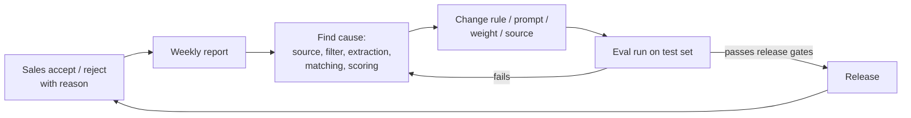

# 11 · Quality and evaluation

Owner of: the test set, the labelling guide, metrics, targets, release gates and the weekly accuracy report. The targets restate [01 §7](01-PRD-MVP.md). The code lives in `worker/evals`.

## 1. Why this matters

Accuracy is the product. The client will judge the system by whether its "Genuine" leads are real. We measure accuracy at every stage, on fixed labelled data, before every release.

## 2. The test set

| Item | Target size | Split |
|---|---|---|
| Labelled source documents | 240: 60 per market group (India, Arab countries, Norway, Malaysia) | 70% tuning, 30% held-out test (never used for tuning) |
| Labelled candidate leads | 150, from real runs | 70 / 30 |
| Company-matching pairs | 300 pairs (same / different), including Arabic–English and abbreviation cases | 70 / 30 |
| Report sentences | 200 sentences from generated reports | Test only |

**The mix of documents per market:**
- 40% tender or prequalification notices
- 30% award or order announcements (exchange filings, owner news)
- 20% trade press
- 10% hard cases: PDFs, scans, Arabic or Malay, lists of many projects, irrelevant look-alikes

**Where they come from:** real collected documents, so they match what the pipeline sees. Storage: `gold_documents` and `gold_labels` (04 §12). Documents are copied into Storage, so they don't change if the site does.

## 3. Labelling guide (summary)

For each document, a labeller records:

1. **Relevant?** Yes or no, plus the lead kind hint.
2. **Project:** name, type, location, stage, and the quote supporting each.
3. **Companies and roles:** every company, with its role (owner, PMC, main EPC, consortium member, subcontractor, supplier, logistics). Role only if the text states it.
4. **Packages and requirements:** discipline, scope, package owner, item, spec, quantity, unit, needed-by date, delivery site or port.
5. **People:** name, title, company, project or package role, contact details printed.
6. **Values and dates:** contract value, currency, award date, closing date.

**Rules:**
- Label only what the text states.
- Mark "not stated" explicitly; it is a correct answer.
- Two labellers do 20% of documents independently. Disagreements are settled by a third reviewer and added to the guide as examples.

**For candidate leads**, a client sales lead labels each one:
- **Genuine?** Yes or no.
- **If no, why:** wrong company, not our scope, too late, too small, duplicate, not real.
- **Right buyer?** Yes or no.

The client provides a sales lead for about **2 hours a week** (PRD §9).

## 4. Metrics

| Area | Metric | Target (held-out test) |
|---|---|---|
| Rules filter | Recall of relevant documents (relevant ones not wrongly dropped) | ≥ 95% |
| Rules filter | Share of fetched documents that go to AI | ≤ 20% |
| Extraction (per field) | Precision / recall / F1 for companies, roles, stage, packages, requirements, people, titles, values, dates | Precision ≥ 95% for company, role and people; ≥ 90% for others. Recall ≥ 80% |
| Extraction | Quote-check pass rate | Tracked; a falling rate means a prompt or model regression |
| Two-model agreement | Precision of `both` facts vs `single` facts | `both` ≥ 97% |
| Company matching | Pair accuracy; false-merge rate | Accuracy ≥ 97%; false merges ≤ 1% |
| Gates | Accuracy of each gate decision against labels | ≥ 95% |
| Classification | **Precision of Genuine** (share the client labels genuine) | **≥ 90%** |
| Classification | Recall of Genuine among leads the client labels genuine | ≥ 70% (secondary; precision comes first) |
| Reports | Sentences passing the fact check on first generation | ≥ 98% |
| Reports | Unsupported sentences shown to users | 0 (they're removed) |
| Operations | Share of Tier A sources with a successful run within 2× schedule | ≥ 95% |
| Cost | Days AI usage exceeded the free budget | 0 |

## 5. How evaluation runs

- `python -m worker.evals run --split test` runs every stage on the frozen test documents and writes an `eval_runs` row with all metrics and the pipeline version (git commit and scoring version).
- **Per-change runs:** any change to prompts, models, rules, matching or scoring must include an eval run on the tuning split, and a test-split run before merge.
- **Cost control:** evals use the same free AI budgets. The full test set takes about 240 documents × 3 passes × 2 models. If needed, it's run over two days, or a 50% sample is used for day-to-day changes and the full set before releases.

## 6. Release gates

A release (a merge to `main` that changes pipeline behaviour) is blocked if any of these fail on the held-out test split:
1. Genuine precision falls below 90%, or drops by more than 2 points from the last release.
2. Company, role or people precision falls below 95%.
3. Company false-merge rate rises above 1%.
4. Any unsupported report sentence reaches the UI in the report test.
5. Unit or integration tests fail (§7).

## 7. Software tests

| Level | What | Tool |
|---|---|---|
| Unit | Quote check, normalisation, spec and money rules, fingerprints, each scoring sub-criterion, confidence formula, gates, outreach rule engine, sanctions matching | pytest, Vitest |
| Integration | One document through read → extract (with recorded AI responses) → resolve → signal → score, against a test database | pytest + Supabase local |
| Reader tests | Each source reader against saved HTML, RSS or JSON fixtures (no live calls in CI) | pytest |
| UI | Find → run progress → inbox → lead page → accept / reject → draft (blocked where required) | Playwright |
| Security | Every API route rejects anonymous requests; the browser can't write protected tables (RLS tests) | Vitest + SQL tests |

## 8. Weekly accuracy report (for the client)

A one-page summary, generated every Monday, showing:
- Leads by class and market; accepted vs rejected, with rejection reasons.
- Genuine precision this week (from sales decisions) vs target.
- The top 3 causes of wrong leads, and what was changed.
- Sources added, removed or failing.
- AI usage vs the free budget.

## 9. Continuous improvement loop

